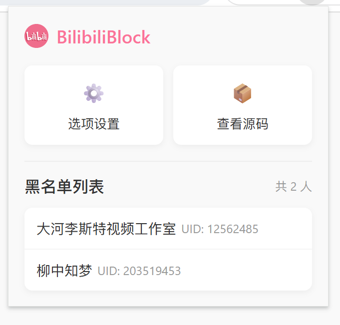
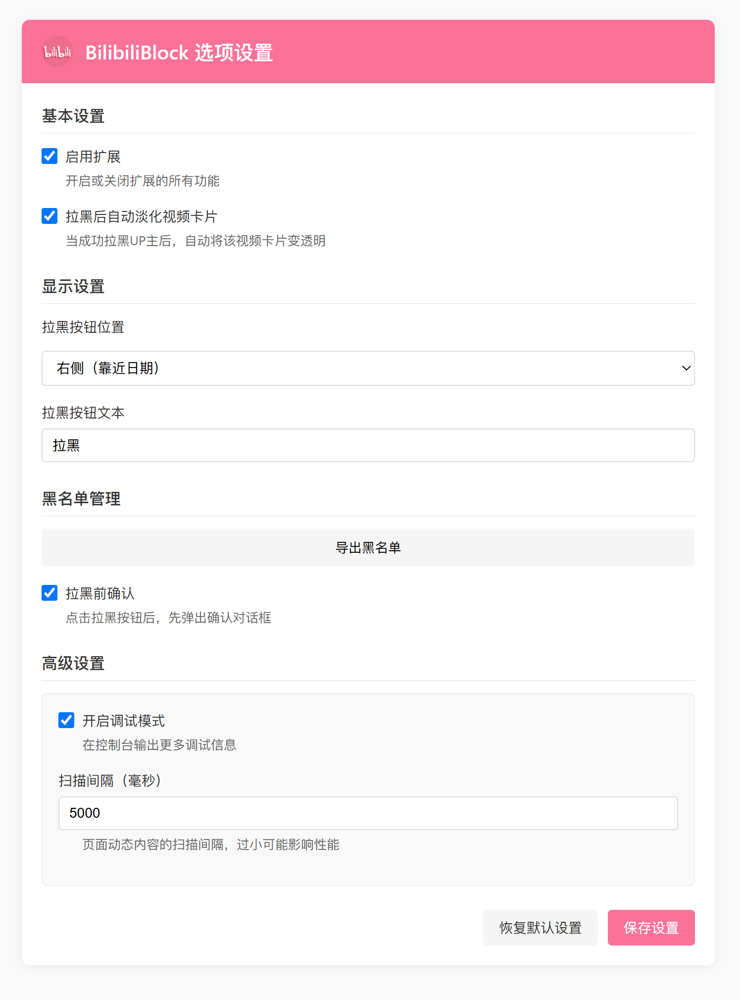

# BilibiliBlock 哔哩哔哩一键拉黑扩展

BilibiliBlock 是一个浏览器扩展，为哔哩哔哩(Bilibili)用户提供一键拉黑UP主的功能。它允许用户直接在视频卡片上拉黑视频作者，无需进入UP主的个人空间页面。

## 功能特点

- **一键拉黑**：在视频卡片上直接拉黑UP主，方便快捷
- **黑名单管理**：查看、导出已拉黑的用户列表
- **自动淡化**：拉黑后自动淡化相关视频卡片
- **适配多种设备**：支持不同分辨率和浏览器的暗色模式
- **高度自定义**：可自定义拉黑按钮的位置、文本等

## 安装方法

### Chrome/Edge 应用商店安装

1. 访问 [Chrome Web Store](https://chrome.google.com/webstore) 或 [Microsoft Edge Add-ons](https://microsoftedge.microsoft.com/addons)
2. 搜索 "BilibiliBlock"
3. 点击 "添加到Chrome" 或 "获取"

### 手动安装（开发者模式）

1. 下载此仓库代码（[下载ZIP](https://github.com/yanstu/BilibiliBlock/archive/main.zip)或克隆仓库）
2. 打开Chrome/Edge浏览器，进入扩展管理页面（在地址栏输入 `chrome://extensions` 或 `edge://extensions`）
3. 开启右上角的"开发者模式"
4. 点击"加载已解压的扩展程序"，选择下载的文件夹
5. 扩展将被安装到浏览器中

## 使用方法

1. 安装扩展后，访问[哔哩哔哩](https://www.bilibili.com/)网站
2. 在视频卡片中，作者名称旁边会出现一个"拉黑"按钮
3. 点击"拉黑"按钮即可将该UP主加入黑名单
4. 点击浏览器工具栏的扩展图标，可以查看黑名单

## 屏幕截图

  
<strong>首页拉黑功能</strong>

  
  
  
<strong>搜索结果页面拉黑功能</strong>

  
  
  
<strong>扩展弹出窗口</strong>

  
  
  
<strong>选项设置</strong>

  

## 技术实现

- 纯JavaScript实现，无第三方依赖
- 使用Chrome扩展API进行存储和通信
- MutationObserver监听页面变化，处理动态加载内容
- 使用模块化设计，分离UI、API和工具函数

## 浏览器兼容性

- Google Chrome 80+
- Microsoft Edge 80+
- 其他基于Chromium的浏览器应该也可以运行

## 隐私声明

BilibiliBlock 尊重用户隐私：

- 不收集任何用户数据
- 所有设置和黑名单仅存储在浏览器本地
- 不包含任何跟踪或分析代码
- 仅请求必要的网站权限

## 贡献指南

欢迎提交问题报告和功能建议！如果您想为项目做出贡献：

1. Fork 这个仓库
2. 创建您的特性分支 (`git checkout -b feature/amazing-feature`)
3. 提交您的更改 (`git commit -m 'Add some amazing feature'`)
4. 推送到分支 (`git push origin feature/amazing-feature`)
5. 开启一个 Pull Request

## 开源许可

本项目采用 MIT 许可证 - 详情见 [LICENSE](LICENSE) 文件。

## 联系方式

项目链接：[https://github.com/yanstu/BilibiliBlock](https://github.com/yanstu/BilibiliBlock)

## 致谢

- 感谢哔哩哔哩提供的平台
- 感谢所有贡献者和用户的支持 